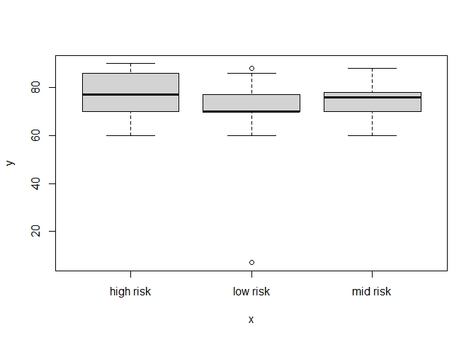
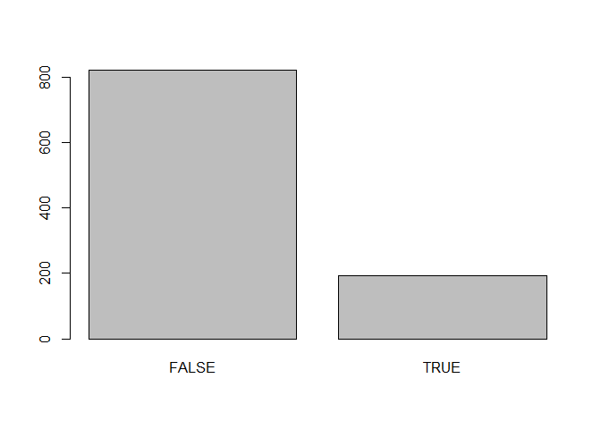

# Intro

In this project,! will gain insight into public health by generating
simple graphical and numerical summaries of a data set collected by the
collected from different hospitals , community clinics, maternal health
cares through the IoT based risk monitoring system.

## What

I would like to determine the risk level of pregnant women of 18 and
less. To help me,i will be using a data set from Kaggle.

## Why

It is important to know if they are on high risk level so that we can
make some sensitization and also work on how to find some solution to
protect them and fight against those condition

## How

I will use R Markdown to determine the rate. I would like to go further
by determining Which health conditions are the strongest indications for
health risks during pregnancy?

# Body

The purpose of this will the be to analyse and calculate the risk level
faced by pregnant women under the age of 18 and know which category of
the conditions affect them the most . By doing this study we can learn
and try to protect their pregnancy .The differ e nt attributes are :
Systolic BP: Upp er value of Blood Pressure in mmHg, another significant
attribute during pregnancy.

Diastolic BP: Lower value of Blood Pressure in mmHg, another significant
attribute during pregnancy.

BS: Blood glucose levels is in terms of a molar concentration, mmol/ L.
Heart Rate: A normal resting heart rate in beats per minute .

Risk Level: Predicted Risk Intensity Level during pregnancy considering
the previous attribute.

## study of the Data

    library(readxl)
    setwd('C:/Users/kamag/Downloads/')
    MAT <- read_excel("MAT.xlsx")
    library(Hmisc)
    describe(MAT)

    ## MAT 
    ## 
    ##  7  Variables      1014  Observations
    ## ------------------------------------------------------
    ## Age 
    ##        n  missing distinct     Info     Mean      Gmd 
    ##     1014        0       50    0.998    29.87    14.93 
    ##      .05      .10      .25      .50      .75      .90 
    ##    13.65    15.00    19.00    26.00    39.00    50.00 
    ##      .95 
    ##    55.00 
    ## 
    ## lowest : 10 12 13 14 15, highest: 62 63 65 66 70
    ## ------------------------------------------------------
    ## SystolicBP 
    ##        n  missing distinct     Info     Mean      Gmd 
    ##     1014        0       19    0.907    113.2       20 
    ##      .05      .10      .25      .50      .75      .90 
    ##       85       90      100      120      120      140 
    ##      .95 
    ##      140 
    ## 
    ## lowest :  70  75  76  78  80, highest: 129 130 135 140 160
    ## 
    ## 70 (7, 0.007), 75 (8, 0.008), 76 (16, 0.016), 78 (3,
    ## 0.003), 80 (5, 0.005), 83 (2, 0.002), 85 (43, 0.042),
    ## 90 (154, 0.152), 95 (12, 0.012), 99 (2, 0.002), 100
    ## (92, 0.091), 110 (19, 0.019), 115 (8, 0.008), 120
    ## (449, 0.443), 129 (1, 0.001), 130 (60, 0.059), 135
    ## (3, 0.003), 140 (120, 0.118), 160 (10, 0.010)
    ## ------------------------------------------------------
    ## DiastolicBP 
    ##        n  missing distinct     Info     Mean      Gmd 
    ##     1014        0       16    0.978    76.46     15.8 
    ##      .05      .10      .25      .50      .75      .90 
    ##       60       60       65       80       90       95 
    ##      .95 
    ##      100 
    ## 
    ## lowest :  49  50  60  63  65, highest:  85  89  90  95 100
    ## 
    ## 49 (25, 0.025), 50 (24, 0.024), 60 (174, 0.172), 63
    ## (8, 0.008), 65 (87, 0.086), 68 (2, 0.002), 69 (1,
    ## 0.001), 70 (100, 0.099), 75 (38, 0.037), 76 (3,
    ## 0.003), 80 (226, 0.223), 85 (49, 0.048), 89 (1,
    ## 0.001), 90 (153, 0.151), 95 (36, 0.036), 100 (87,
    ## 0.086)
    ## ------------------------------------------------------
    ## BS 
    ##        n  missing distinct     Info     Mean      Gmd 
    ##     1014        0       29    0.991    8.726    2.979 
    ##      .05      .10      .25      .50      .75      .90 
    ##     6.10     6.70     6.90     7.50     8.00    15.00 
    ##      .95 
    ##    17.35 
    ## 
    ## lowest :  6.0  6.1  6.3  6.4  6.5, highest: 15.0 16.0 17.0 18.0 19.0
    ## ------------------------------------------------------
    ## BodyTemp 
    ##        n  missing distinct     Info     Mean      Gmd 
    ##     1014        0        8      0.5    98.67    1.098 
    ## 
    ## lowest :  98.0  98.4  98.6  99.0 100.0
    ## highest:  99.0 100.0 101.0 102.0 103.0
    ##                                                     
    ## Value       98.0  98.4  98.6  99.0 100.0 101.0 102.0
    ## Frequency    804     2     1    10    20    98    66
    ## Proportion 0.793 0.002 0.001 0.010 0.020 0.097 0.065
    ##                 
    ## Value      103.0
    ## Frequency     13
    ## Proportion 0.013
    ## ------------------------------------------------------
    ## HeartRate 
    ##        n  missing distinct     Info     Mean      Gmd 
    ##     1014        0       16    0.975     74.3    8.653 
    ##      .05      .10      .25      .50      .75      .90 
    ##       60       66       70       76       80       86 
    ##      .95 
    ##       88 
    ## 
    ## lowest :  7 60 65 66 67, highest: 80 82 86 88 90
    ## 
    ## 7 (2, 0.002), 60 (74, 0.073), 65 (5, 0.005), 66 (87,
    ## 0.086), 67 (12, 0.012), 68 (2, 0.002), 70 (271,
    ## 0.267), 75 (19, 0.019), 76 (131, 0.129), 77 (96,
    ## 0.095), 78 (46, 0.045), 80 (117, 0.115), 82 (19,
    ## 0.019), 86 (55, 0.054), 88 (59, 0.058), 90 (19,
    ## 0.019)
    ## ------------------------------------------------------
    ## RiskLevel 
    ##        n  missing distinct 
    ##     1014        0        3 
    ##                                         
    ## Value      high risk  low risk  mid risk
    ## Frequency        272       406       336
    ## Proportion     0.268     0.400     0.331
    ## ------------------------------------------------------

In this that data we have 7 variable for 1014 Oobservation

## Distribution of Risk Level

    table(MAT$RiskLevel)

    ## 
    ## high risk  low risk  mid risk 
    ##       272       406       336

We know from the distribution that most of the pregnant women have A low
risk conditions .

    RiskLevel <- table(MAT$RiskLevel)
    plot(as.factor(MAT$RiskLevel),MAT$HeartRate)

    anova(aov(HeartRate ~ RiskLevel, data=MAT))

    ## Analysis of Variance Table
    ## 
    ## Response: HeartRate
    ##             Df Sum Sq Mean Sq F value    Pr(>F)    
    ## RiskLevel    2   2577 1288.67  20.453 1.961e-09 ***
    ## Residuals 1011  63700   63.01                      
    ## ---
    ## Signif. codes:  
    ## 0 '***' 0.001 '**' 0.01 '*' 0.05 '.' 0.1 ' ' 1

    head(MAT)

    ## # A tibble: 6 x 7
    ##     Age SystolicBP DiastolicBP    BS BodyTemp
    ##   <dbl>      <dbl>       <dbl> <dbl>    <dbl>
    ## 1    25        130          80 15          98
    ## 2    35        140          90 13          98
    ## 3    29         90          70  8         100
    ## 4    30        140          85  7          98
    ## 5    35        120          60  6.1        98
    ## 6    23        140          80  7.01       98
    ## # ... with 2 more variables: HeartRate <dbl>,
    ## #   RiskLevel <chr>

    tail(MAT)

    ## # A tibble: 6 x 7
    ##     Age SystolicBP DiastolicBP    BS BodyTemp
    ##   <dbl>      <dbl>       <dbl> <dbl>    <dbl>
    ## 1    48        120          80    11       98
    ## 2    22        120          60    15       98
    ## 3    55        120          90    18       98
    ## 4    35         85          60    19       98
    ## 5    43        120          90    18       98
    ## 6    32        120          65     6      101
    ## # ... with 2 more variables: HeartRate <dbl>,
    ## #   RiskLevel <chr>

## Pregnant women under 18

    table(MAT$Age<18)

    ## 
    ## FALSE  TRUE 
    ##   821   193

    Age <- table(MAT$Age<18) 
    barplot(Age)

## Pregnant women under 18 with high risk level

    ltage18 <- subset(MAT, Age<18) 
    ltage18

    ## # A tibble: 193 x 7
    ##      Age SystolicBP DiastolicBP    BS BodyTemp
    ##    <dbl>      <dbl>       <dbl> <dbl>    <dbl>
    ##  1    15        120          80  7.01       98
    ##  2    10         70          50  6.9        98
    ##  3    16        100          70  7.2        98
    ##  4    12         95          60  6.1       102
    ##  5    15         76          49  7.5        98
    ##  6    15        120          80  7          98
    ##  7    15         76          49  6.4        98
    ##  8    15        120          80  7.2        98
    ##  9    15         80          60  7          98
    ## 10    12         95          60  7.2        98
    ## # ... with 183 more rows, and 2 more variables:
    ## #   HeartRate <dbl>, RiskLevel <chr>

    MAT$RiskLevel == "high risk"

    ##    [1]  TRUE  TRUE  TRUE  TRUE FALSE  TRUE FALSE  TRUE
    ##    [9] FALSE  TRUE FALSE FALSE FALSE FALSE FALSE FALSE
    ##   [17]  TRUE  TRUE FALSE FALSE  TRUE FALSE FALSE FALSE
    ##   [25] FALSE FALSE FALSE FALSE FALSE FALSE FALSE FALSE
    ##   [33] FALSE FALSE FALSE FALSE FALSE FALSE FALSE FALSE
    ##   [41] FALSE FALSE FALSE FALSE FALSE FALSE FALSE FALSE
    ##   [49] FALSE FALSE FALSE FALSE FALSE FALSE FALSE FALSE
    ##   [57] FALSE FALSE FALSE FALSE FALSE FALSE FALSE FALSE
    ##   [65] FALSE FALSE FALSE FALSE FALSE FALSE FALSE FALSE
    ##   [73] FALSE FALSE FALSE FALSE FALSE FALSE FALSE FALSE
    ##   [81] FALSE FALSE FALSE FALSE FALSE FALSE FALSE FALSE
    ##   [89] FALSE FALSE FALSE FALSE FALSE FALSE FALSE FALSE
    ##   [97] FALSE FALSE FALSE FALSE FALSE FALSE  TRUE  TRUE
    ##  [105]  TRUE  TRUE  TRUE  TRUE  TRUE  TRUE  TRUE  TRUE
    ##  [113]  TRUE  TRUE  TRUE  TRUE  TRUE  TRUE  TRUE  TRUE
    ##  [121]  TRUE  TRUE  TRUE  TRUE  TRUE  TRUE  TRUE  TRUE
    ##  [129]  TRUE  TRUE  TRUE  TRUE  TRUE  TRUE  TRUE  TRUE
    ##  [137]  TRUE  TRUE  TRUE FALSE  TRUE FALSE FALSE FALSE
    ##  [145] FALSE  TRUE FALSE FALSE FALSE  TRUE FALSE FALSE
    ##  [153]  TRUE FALSE FALSE FALSE FALSE  TRUE FALSE FALSE
    ##  [161] FALSE FALSE FALSE FALSE FALSE FALSE  TRUE  TRUE
    ##  [169] FALSE FALSE FALSE  TRUE FALSE FALSE FALSE FALSE
    ##  [177]  TRUE  TRUE  TRUE FALSE FALSE  TRUE  TRUE  TRUE
    ##  [185] FALSE FALSE FALSE FALSE FALSE FALSE FALSE  TRUE
    ##  [193]  TRUE  TRUE FALSE FALSE FALSE FALSE FALSE  TRUE
    ##  [201] FALSE FALSE FALSE FALSE FALSE  TRUE  TRUE FALSE
    ##  [209] FALSE FALSE  TRUE FALSE FALSE FALSE FALSE FALSE
    ##  [217] FALSE  TRUE FALSE FALSE FALSE FALSE FALSE FALSE
    ##  [225] FALSE FALSE FALSE  TRUE  TRUE FALSE  TRUE  TRUE
    ##  [233]  TRUE FALSE  TRUE  TRUE  TRUE  TRUE  TRUE  TRUE
    ##  [241]  TRUE  TRUE FALSE FALSE FALSE  TRUE FALSE FALSE
    ##  [249]  TRUE  TRUE FALSE FALSE FALSE FALSE FALSE FALSE
    ##  [257] FALSE FALSE FALSE FALSE FALSE FALSE  TRUE  TRUE
    ##  [265] FALSE FALSE FALSE  TRUE FALSE FALSE FALSE FALSE
    ##  [273]  TRUE  TRUE  TRUE FALSE  TRUE  TRUE  TRUE  TRUE
    ##  [281] FALSE FALSE FALSE FALSE FALSE  TRUE FALSE  TRUE
    ##  [289] FALSE FALSE FALSE FALSE FALSE FALSE FALSE  TRUE
    ##  [297] FALSE FALSE FALSE FALSE FALSE  TRUE  TRUE FALSE
    ##  [305] FALSE FALSE FALSE FALSE FALSE FALSE FALSE FALSE
    ##  [313] FALSE FALSE FALSE FALSE  TRUE  TRUE FALSE  TRUE
    ##  [321]  TRUE FALSE FALSE FALSE FALSE FALSE FALSE  TRUE
    ##  [329] FALSE  TRUE FALSE FALSE FALSE FALSE FALSE FALSE
    ##  [337] FALSE FALSE FALSE FALSE FALSE  TRUE FALSE FALSE
    ##  [345] FALSE  TRUE FALSE FALSE  TRUE FALSE FALSE FALSE
    ##  [353] FALSE  TRUE  TRUE  TRUE  TRUE FALSE FALSE FALSE
    ##  [361] FALSE FALSE  TRUE  TRUE FALSE FALSE FALSE  TRUE
    ##  [369]  TRUE  TRUE FALSE  TRUE FALSE  TRUE  TRUE  TRUE
    ##  [377] FALSE FALSE FALSE FALSE FALSE FALSE  TRUE FALSE
    ##  [385] FALSE FALSE FALSE FALSE FALSE FALSE  TRUE FALSE
    ##  [393] FALSE FALSE FALSE FALSE FALSE  TRUE FALSE FALSE
    ##  [401] FALSE FALSE FALSE FALSE FALSE FALSE FALSE FALSE
    ##  [409] FALSE FALSE FALSE FALSE FALSE FALSE FALSE  TRUE
    ##  [417] FALSE  TRUE FALSE  TRUE FALSE FALSE  TRUE FALSE
    ##  [425] FALSE  TRUE  TRUE FALSE  TRUE FALSE FALSE  TRUE
    ##  [433]  TRUE FALSE FALSE  TRUE  TRUE  TRUE FALSE FALSE
    ##  [441]  TRUE FALSE  TRUE FALSE FALSE FALSE FALSE FALSE
    ##  [449] FALSE  TRUE FALSE  TRUE  TRUE FALSE FALSE FALSE
    ##  [457]  TRUE FALSE  TRUE FALSE FALSE FALSE FALSE FALSE
    ##  [465] FALSE FALSE FALSE  TRUE  TRUE FALSE FALSE  TRUE
    ##  [473] FALSE  TRUE FALSE FALSE FALSE FALSE FALSE FALSE
    ##  [481] FALSE FALSE  TRUE FALSE FALSE FALSE  TRUE FALSE
    ##  [489]  TRUE  TRUE FALSE FALSE FALSE FALSE FALSE FALSE
    ##  [497] FALSE FALSE FALSE FALSE FALSE FALSE  TRUE  TRUE
    ##  [505]  TRUE FALSE  TRUE FALSE  TRUE FALSE FALSE FALSE
    ##  [513] FALSE FALSE FALSE FALSE FALSE FALSE FALSE  TRUE
    ##  [521] FALSE FALSE FALSE FALSE FALSE FALSE FALSE FALSE
    ##  [529] FALSE FALSE  TRUE FALSE  TRUE  TRUE FALSE FALSE
    ##  [537] FALSE FALSE  TRUE  TRUE FALSE FALSE FALSE FALSE
    ##  [545] FALSE FALSE FALSE FALSE  TRUE  TRUE FALSE FALSE
    ##  [553] FALSE FALSE  TRUE FALSE FALSE FALSE FALSE FALSE
    ##  [561] FALSE FALSE FALSE FALSE FALSE FALSE  TRUE FALSE
    ##  [569] FALSE FALSE FALSE FALSE FALSE FALSE FALSE FALSE
    ##  [577] FALSE FALSE  TRUE FALSE FALSE FALSE FALSE  TRUE
    ##  [585]  TRUE FALSE FALSE FALSE FALSE FALSE FALSE FALSE
    ##  [593] FALSE  TRUE  TRUE  TRUE FALSE  TRUE  TRUE  TRUE
    ##  [601]  TRUE FALSE  TRUE  TRUE FALSE FALSE FALSE FALSE
    ##  [609] FALSE FALSE  TRUE FALSE FALSE  TRUE  TRUE  TRUE
    ##  [617] FALSE FALSE FALSE FALSE  TRUE FALSE FALSE FALSE
    ##  [625] FALSE FALSE FALSE  TRUE FALSE FALSE  TRUE  TRUE
    ##  [633]  TRUE FALSE FALSE FALSE  TRUE  TRUE  TRUE FALSE
    ##  [641]  TRUE  TRUE FALSE FALSE  TRUE FALSE FALSE FALSE
    ##  [649] FALSE FALSE FALSE FALSE FALSE FALSE FALSE  TRUE
    ##  [657] FALSE  TRUE  TRUE FALSE FALSE FALSE  TRUE FALSE
    ##  [665] FALSE FALSE FALSE FALSE FALSE FALSE FALSE FALSE
    ##  [673] FALSE FALSE FALSE  TRUE  TRUE  TRUE  TRUE  TRUE
    ##  [681]  TRUE  TRUE  TRUE  TRUE  TRUE  TRUE  TRUE  TRUE
    ##  [689]  TRUE  TRUE FALSE FALSE FALSE FALSE FALSE FALSE
    ##  [697] FALSE FALSE FALSE FALSE FALSE FALSE FALSE FALSE
    ##  [705] FALSE FALSE FALSE FALSE FALSE FALSE FALSE FALSE
    ##  [713] FALSE FALSE FALSE FALSE FALSE FALSE FALSE FALSE
    ##  [721] FALSE FALSE FALSE FALSE FALSE FALSE FALSE FALSE
    ##  [729] FALSE FALSE FALSE FALSE FALSE FALSE FALSE FALSE
    ##  [737] FALSE FALSE FALSE FALSE FALSE FALSE FALSE FALSE
    ##  [745] FALSE FALSE FALSE FALSE FALSE FALSE FALSE FALSE
    ##  [753] FALSE FALSE FALSE FALSE FALSE FALSE FALSE FALSE
    ##  [761] FALSE FALSE FALSE FALSE FALSE FALSE FALSE FALSE
    ##  [769] FALSE FALSE FALSE FALSE FALSE FALSE FALSE FALSE
    ##  [777] FALSE FALSE FALSE FALSE FALSE FALSE FALSE FALSE
    ##  [785] FALSE FALSE FALSE FALSE FALSE FALSE FALSE FALSE
    ##  [793] FALSE FALSE FALSE FALSE FALSE FALSE FALSE FALSE
    ##  [801] FALSE FALSE FALSE FALSE FALSE FALSE FALSE FALSE
    ##  [809] FALSE FALSE FALSE FALSE FALSE FALSE FALSE FALSE
    ##  [817] FALSE FALSE FALSE FALSE FALSE FALSE FALSE FALSE
    ##  [825] FALSE FALSE FALSE FALSE FALSE FALSE FALSE FALSE
    ##  [833] FALSE FALSE FALSE FALSE FALSE FALSE FALSE FALSE
    ##  [841] FALSE FALSE FALSE FALSE FALSE FALSE FALSE FALSE
    ##  [849] FALSE FALSE FALSE FALSE FALSE FALSE FALSE FALSE
    ##  [857] FALSE FALSE FALSE FALSE FALSE FALSE FALSE FALSE
    ##  [865] FALSE FALSE FALSE FALSE FALSE FALSE FALSE FALSE
    ##  [873] FALSE FALSE FALSE FALSE FALSE FALSE FALSE FALSE
    ##  [881] FALSE FALSE FALSE FALSE FALSE FALSE FALSE FALSE
    ##  [889] FALSE FALSE FALSE FALSE FALSE FALSE FALSE FALSE
    ##  [897] FALSE FALSE FALSE FALSE FALSE FALSE FALSE FALSE
    ##  [905] FALSE FALSE FALSE FALSE FALSE FALSE FALSE FALSE
    ##  [913] FALSE FALSE FALSE FALSE FALSE FALSE FALSE FALSE
    ##  [921] FALSE FALSE FALSE FALSE FALSE FALSE FALSE FALSE
    ##  [929] FALSE FALSE FALSE FALSE FALSE FALSE FALSE FALSE
    ##  [937] FALSE FALSE FALSE FALSE FALSE FALSE FALSE FALSE
    ##  [945] FALSE FALSE FALSE FALSE FALSE FALSE FALSE FALSE
    ##  [953] FALSE FALSE  TRUE  TRUE  TRUE  TRUE  TRUE  TRUE
    ##  [961]  TRUE  TRUE  TRUE  TRUE  TRUE  TRUE  TRUE  TRUE
    ##  [969]  TRUE  TRUE  TRUE  TRUE  TRUE  TRUE  TRUE  TRUE
    ##  [977]  TRUE  TRUE  TRUE  TRUE  TRUE  TRUE  TRUE  TRUE
    ##  [985]  TRUE  TRUE  TRUE  TRUE  TRUE  TRUE  TRUE  TRUE
    ##  [993]  TRUE  TRUE  TRUE  TRUE  TRUE  TRUE  TRUE  TRUE
    ##  [ reached getOption("max.print") -- omitted 14 entries ]

    hr <- MAT$RiskLevel == "high risk"
    hr <- subset(MAT, MAT$RiskLevel == "high risk")
    p18_highrisk <- subset(ltage18, ltage18$RiskLevel == "high risk")

From the research above we can see that 37 seven person out 272 from the
list of women under 18 are in high risk . This represent 13% of the list
. It’s a small percentage but it is still not to be be neglected.

## Study of the different condition

## DiastolicBP

    summary(MAT$DiastolicBP)

    ##    Min. 1st Qu.  Median    Mean 3rd Qu.    Max. 
    ##   49.00   65.00   80.00   76.46   90.00  100.00

## systolicBP

    summary(MAT$SystolicBP)

    ##    Min. 1st Qu.  Median    Mean 3rd Qu.    Max. 
    ##    70.0   100.0   120.0   113.2   120.0   160.0

## BS

    summary(MAT$BS)

    ##    Min. 1st Qu.  Median    Mean 3rd Qu.    Max. 
    ##   6.000   6.900   7.500   8.726   8.000  19.000

## Heart Rate

    summary(MAT$HeartRate)

    ##    Min. 1st Qu.  Median    Mean 3rd Qu.    Max. 
    ##     7.0    70.0    76.0    74.3    80.0    90.0

# Topics From Class

## Rmarkdown:

One of my favorite things to use this semester, it is my first semester
in Business Analytics I was scared at the beginning but really after
having one class I really loved it.

## Github:

This is an also something I enjoy learning I did not go yet as far I
wanted to go for now but I will like to learn more about it. ## HMISC
package: I used the package hmisc to describe the Data have and more
incite of the Data.

## Anova:

I used this topics from the suggestion of one of the student and it came
out great. It really help me have create a great visualisation .

## Data subsetting:

This one of my favorite I really enjoy using it in my homeworks so I
decide to use it for my project and it really me acheive what I was
looking for.

# Conclusion

This project help me learn a lot , it help me surpass myself and succeed
my research. It help me learn new function also go back to what I
learned in class and study them more. It help me advance my knowledge
This is my first semester ,I was scared at beginning but i learned that
nothing is too hard or too easy we just have be ready to work harder.

# Citation:

HMISC: Donovan, K. (2019, July 11). Data Analysis and processing with R
based on Ibis Data. 9 Docu­ menting your results with R Markdown.
Retrieved May 8, 2022, from  
<https://bookdown.org/kdonovan125/> ibis\_data\_analysis\_ r4/
documenting-your-results-with- r-markdown.html
